# 
 DIO - BootCamp DataBase Experience 

## 
 16 - Construa um Projeto Logico de Banco de Dados do Zero

*Desafio do projeto:*

1. Mapeamento do esquema ER para Relacional
2. Definição do script SQL para criação do esquema de banco de dados
3. Persistência de dados para testes
4. Recuperação de informações com queries SQL

*Sendo assim, crie queries SQL com as cláusulas abaixo:*

* Recuperações simples com SELECT Statement
* Filtros com WHERE Statement
* Crie expressões para gerar atributos derivados
* Defina ordenações dos dados com ORDER BY
* Condições de filtros aos grupos – HAVING Statement
* Crie junções entre tabelas para fornecer uma
* perspectiva mais complexa dos dados

---

### 1. Mapeamento do esquema ER para Relacional

#### 'oficina' - EER(Enhanced entity–relationship model)

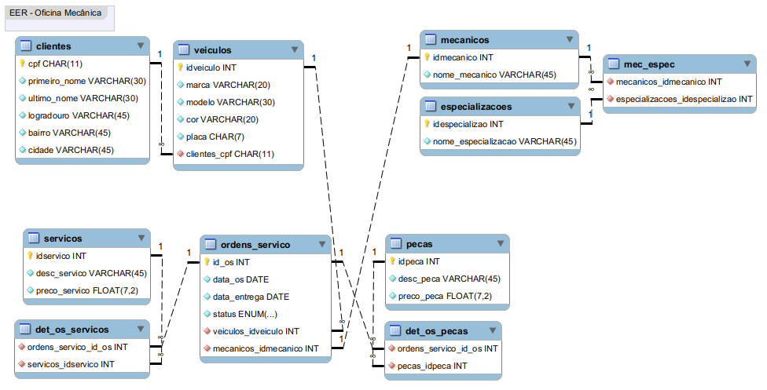

---

### 2. Definição do script SQL para criação do esquema de banco de dados

-- MySQL Workbench Forward Engineering

SET @OLD_UNIQUE_CHECKS=@@UNIQUE_CHECKS, UNIQUE_CHECKS=0;
SET @OLD_FOREIGN_KEY_CHECKS=@@FOREIGN_KEY_CHECKS, FOREIGN_KEY_CHECKS=0;
SET @OLD_SQL_MODE=@@SQL_MODE, SQL_MODE='ONLY_FULL_GROUP_BY,STRICT_TRANS_TABLES,NO_ZERO_IN_DATE,NO_ZERO_DATE,ERROR_FOR_DIVISION_BY_ZERO,NO_ENGINE_SUBSTITUTION';

-- -----------------------------------------------------
-- Schema oficina
-- -----------------------------------------------------
CREATE SCHEMA IF NOT EXISTS `oficina` ;
USE `oficina` ;

-- -----------------------------------------------------
-- Table `oficina`.`clientes`
-- -----------------------------------------------------
CREATE TABLE IF NOT EXISTS `oficina`.`clientes` (
  `cpf` CHAR(11) NOT NULL,
  `primeiro_nome` VARCHAR(30) NOT NULL,
  `ultimo_nome` VARCHAR(30) NOT NULL,
  `logradouro` VARCHAR(45) NOT NULL,
  `bairro` VARCHAR(45) NOT NULL,
  `cidade` VARCHAR(45) NOT NULL,
  PRIMARY KEY (`cpf`))
ENGINE = InnoDB
COMMENT = 'Tabela cadastro de clientes';

-- -----------------------------------------------------
-- Table `oficina`.`veiculos`
-- -----------------------------------------------------
CREATE TABLE IF NOT EXISTS `oficina`.`veiculos` (
  `idveiculo` INT NOT NULL AUTO_INCREMENT,
  `marca` VARCHAR(20) NOT NULL,
  `modelo` VARCHAR(30) NOT NULL,
  `cor` VARCHAR(20) NOT NULL,
  `placa` CHAR(7) NOT NULL,
  `clientes_cpf` CHAR(11) NOT NULL,
  PRIMARY KEY (`idveiculo`),
  INDEX `fk_veiculos_clientes_idx` (`clientes_cpf` ASC) VISIBLE,
  CONSTRAINT `fk_veiculos_clientes`
    FOREIGN KEY (`clientes_cpf`)
    REFERENCES `oficina`.`clientes` (`cpf`)
    ON DELETE NO ACTION
    ON UPDATE NO ACTION)
ENGINE = InnoDB
COMMENT = 'Tabela cadastro de veículos';

-- -----------------------------------------------------
-- Table `oficina`.`mecanicos`
-- -----------------------------------------------------
CREATE TABLE IF NOT EXISTS `oficina`.`mecanicos` (
  `idmecanico` INT NOT NULL,
  `nome_mecanico` VARCHAR(45) NOT NULL,
  PRIMARY KEY (`idmecanico`))
ENGINE = InnoDB
COMMENT = 'Tabela dos mecânicos da oficina.';

-- -----------------------------------------------------
-- Table `oficina`.`especializacoes`
-- -----------------------------------------------------
CREATE TABLE IF NOT EXISTS `oficina`.`especializacoes` (
  `idespecializacao` INT NOT NULL AUTO_INCREMENT,
  `nome_especializacao` VARCHAR(45) NOT NULL,
  PRIMARY KEY (`idespecializacao`))
ENGINE = InnoDB
COMMENT = 'Tabela dos tipos de especializações.';

-- -----------------------------------------------------
-- Table `oficina`.`mec_espec`
-- -----------------------------------------------------
CREATE TABLE IF NOT EXISTS `oficina`.`mec_espec` (
  `mecanicos_idmecanico` INT NOT NULL,
  `especializacoes_idespecializao` INT NOT NULL,
  INDEX `fk_mec_espec_mecanicos1_idx` (`mecanicos_idmecanico` ASC) VISIBLE,
  INDEX `fk_mec_espec_especializacoes1_idx` (`especializacoes_idespecializacao` ASC) VISIBLE,
  CONSTRAINT `fk_mec_espec_mecanicos1`
    FOREIGN KEY (`mecanicos_idmecanico`)
    REFERENCES `oficina`.`mecanicos` (`idmecanico`)
    ON DELETE NO ACTION
    ON UPDATE NO ACTION,
  CONSTRAINT `fk_mec_espec_especializacoes1`
    FOREIGN KEY (`especializacoes_idespecializao`)
    REFERENCES `oficina`.`especializacoes` (`idespecializao`)
    ON DELETE NO ACTION
    ON UPDATE NO ACTION)
ENGINE = InnoDB
COMMENT = 'Tabela das especializações dos mecânicos.';

-- -----------------------------------------------------
-- Table `oficina`.`servicos`
-- -----------------------------------------------------
CREATE TABLE IF NOT EXISTS `oficina`.`servicos` (
  `idservico` INT NOT NULL AUTO_INCREMENT,
  `desc_servico` VARCHAR(45) NOT NULL,
  `preco_servico` FLOAT(7,2) NOT NULL,
  PRIMARY KEY (`idservico`))
ENGINE = InnoDB
COMMENT = 'Tabela dos tipos e preço dos serviços';

-- -----------------------------------------------------
-- Table `oficina`.`pecas`
-- -----------------------------------------------------
CREATE TABLE IF NOT EXISTS `oficina`.`pecas` (
  `idpeca` INT NOT NULL AUTO_INCREMENT,
  `desc_peca` VARCHAR(45) NOT NULL,
  `preco_peca` FLOAT(7,2) NOT NULL,
  PRIMARY KEY (`idpeca`))
ENGINE = InnoDB
COMMENT = 'Tabela cadastro de peças e preços';

-- -----------------------------------------------------
-- Table `oficina`.`ordens_servico`
-- -----------------------------------------------------
CREATE TABLE IF NOT EXISTS `oficina`.`ordens_servico` (
  `id_os` INT NOT NULL AUTO_INCREMENT,
  `data_os` DATE NOT NULL,
  `data_entrega` DATE NOT NULL,
  `status` ENUM('Avaliação', 'Autorizado', 'Cancelado') NOT NULL DEFAULT 'Avaliação',
  `veiculos_idveiculo` INT NOT NULL,
  `mecanicos_idmecanico` INT NOT NULL,
  PRIMARY KEY (`id_os`),
  INDEX `fk_ordens_servico_veiculos1_idx` (`veiculos_idveiculo` ASC) VISIBLE,
  INDEX `fk_ordens_servico_mecanicos1_idx` (`mecanicos_idmecanico` ASC) VISIBLE,
  CONSTRAINT `fk_ordens_servico_veiculos1`
    FOREIGN KEY (`veiculos_idveiculo`)
    REFERENCES `oficina`.`veiculos` (`idveiculo`)
    ON DELETE NO ACTION
    ON UPDATE NO ACTION,
  CONSTRAINT `fk_ordens_servico_mecanicos1`
    FOREIGN KEY (`mecanicos_idmecanico`)
    REFERENCES `oficina`.`mecanicos` (`idmecanico`)
    ON DELETE NO ACTION
    ON UPDATE NO ACTION)
ENGINE = InnoDB
COMMENT = 'Tabela Ordens de Serviços.';

-- -----------------------------------------------------
-- Table `oficina`.`det_os_servicos`
-- -----------------------------------------------------
CREATE TABLE IF NOT EXISTS `oficina`.`det_os_servicos` (
  `ordens_servico_id_os` INT NOT NULL,
  `servicos_idservico` INT NOT NULL,
  INDEX `fk_det_os_servicos_servicos1_idx` (`servicos_idservico` ASC) VISIBLE,
  INDEX `fk_det_os_servicos_ordens_servico1_idx` (`ordens_servico_id_os` ASC) VISIBLE,
  CONSTRAINT `fk_det_os_servicos_servicos1`
    FOREIGN KEY (`servicos_idservico`)
    REFERENCES `oficina`.`servicos` (`idservico`)
    ON DELETE NO ACTION
    ON UPDATE NO ACTION,
  CONSTRAINT `fk_det_os_servicos_ordens_servico1`
    FOREIGN KEY (`ordens_servico_id_os`)
    REFERENCES `oficina`.`ordens_servico` (`id_os`)
    ON DELETE NO ACTION
    ON UPDATE NO ACTION)
ENGINE = InnoDB
COMMENT = 'Tabela detalhamento somente dos serviços (sem peças)';

-- -----------------------------------------------------
-- Table `oficina`.`det_os_pecas`
-- -----------------------------------------------------
CREATE TABLE IF NOT EXISTS `oficina`.`det_os_pecas` (
  `ordens_servico_id_os` INT NOT NULL,
  `pecas_idpeca` INT NOT NULL,
  INDEX `fk_det_os_pecas_ordens_servico1_idx` (`ordens_servico_id_os` ASC) VISIBLE,
  INDEX `fk_det_os_pecas_pecas1_idx` (`pecas_idpeca` ASC) VISIBLE,
  CONSTRAINT `fk_det_os_pecas_ordens_servico1`
    FOREIGN KEY (`ordens_servico_id_os`)
    REFERENCES `oficina`.`ordens_servico` (`id_os`)
    ON DELETE NO ACTION
    ON UPDATE NO ACTION,
  CONSTRAINT `fk_det_os_pecas_pecas1`
    FOREIGN KEY (`pecas_idpeca`)
    REFERENCES `oficina`.`pecas` (`idpeca`)
    ON DELETE NO ACTION
    ON UPDATE NO ACTION)
ENGINE = InnoDB
COMMENT = 'Tabela detalhamento das peças que compõem o serviço.';

SET SQL_MODE=@OLD_SQL_MODE;
SET FOREIGN_KEY_CHECKS=@OLD_FOREIGN_KEY_CHECKS;
SET UNIQUE_CHECKS=@OLD_UNIQUE_CHECKS;

---

### 3. Persistência de dados para testes

INSERT INTO clientes (cpf, primeiro_nome, ultimo_nome, logradouro, bairro, cidade) 
VALUES
('57489365584','Simone','Cintra','Rua Marte, 166','Santo Ignácio','São Paulo'),
('21568332411','Carla','Oliveira','Rua Vênus, 99','Nova York','Belo Horizonte'),
('88742695583','Anderson','Coelho','Rua Nove, 77','Santo Agostinho','Belo Horizonte'),
('66577423984','Maria','Lima','Rua Lins, 600','Brás','Santo Amaro'),
('11458962279','Leonardo','Santos','Rua Genova, 10','Asa Norte','Rio de Janeiro'),
('99523687445','Marina','Costa','Rua Paris, 74','Bairro Santo Antônio','Belo Horizonte');

INSERT INTO veiculos (marca, modelo, cor, placa, clientes_cpf) 
VALUES
('Chevrolet','Onix','Prata','LSU3J43','11458962279'),
('Fiat','Toro','Branca','AKI3P58','57489365584'),
('Fiat','Punto','Preta','KJJ5I97','99523687445'),
('Volkswagen','Saveiro','Branca','MMY8S22','88742695583'),
('Renault','Duster','Prata','PCP4L66','11458962279'),
('Honda','Fit','Prata','HFR1U88','21568332411'),
('Volkswagen','UP','Vermelha','GFR4Y22','88742695583');

INSERT INTO mecanicos (nome_mecanico) 
VALUES
('José Geraldo Brás'),
('Francisco de Araújo Gomes'),
('Márcio Arruda da Silva'),
('Vander de Assis');

INSERT INTO especializacoes (nome_especializacao) 
VALUES
('Eletricista Automotivo'),
('Pintor Automotivo'),
('Lanternagem Automotiva'),
('Mecânica Automotiva');

INSERT INTO mec_espec (mecanicos_idmecanico, especializacoes_idespecializacao) 
VALUES
(4,1),
(1,2),
(3,3),
(1,2),
(2,4),
(2,3),
(3,4);

INSERT INTO servicos (desc_servico, preco_servico) 
VALUES
('Manutenção da embreagem',270.00),
('Revisão dos componentes de Freio',325.85),
('Troca de óleo do motor',230.00),
('Troca de lâmpadas',40.00),
('Alinhamento e Balanceamento',220.00),
('Revisão no Sistema de Arrefecimento',305.00),
('Pintura Automotiva (Completa)',2150.00);

INSERT INTO pecas (desc_peca, preco_peca) 
VALUES
('Filtro De Ar Automotivo',158.90),
('Kit de Farol para Carro Automotivo Lanterna',153.45),
('Kit Conector Chicote Radio e Antena',32.00),
('Pastilhas Freio Acdelco Meriva/montana/corsa',116.39),
('Tinta automotiva poliéster 900ml - Cinza',55.00),
('Kit Embreagem Plato Disco Original - GM',558.17),
('Óleo Motor Texaco Havoline Semissintético',49.90);

INSERT INTO ordens_servico (data_os, data_entrega, status, veiculos_idveiculo, mecanicos_idmecanico) 
VALUES
('2022-09-19','2022-09-19','Avaliação',3,2),
('2022-09-19','2022-09-25','Autorizado',5,1),
('2022-09-19','2022-09-20','Autorizado',4,3),
('2022-09-19','2022-09-20','Autorizado',1,4);

INSERT INTO det_os_servicos (ordens_servico_id_os, servicos_idservico) 
VALUES
(5,3),
(6,7),
(7,5),
(8,1);

INSERT INTO det_os_pecas (ordens_servico_id_os, pecas_idpeca) 
VALUES
(5,28),
(6,26);

---

### 4. Recuperação de informações com queries SQL

***Recuperações simples com SELECT Statement***

* ***clientes*** 
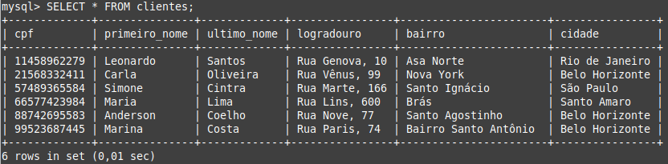
* ***veiculos***
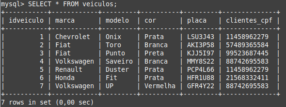
* ***mecanicos***
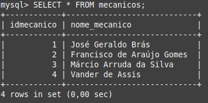
* ***especializacoes***
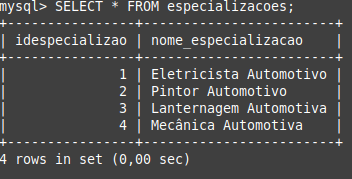
* ***mec_espec***
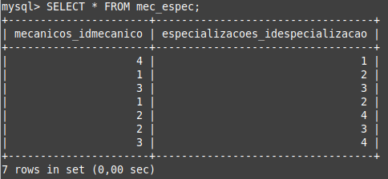
* ***servicos***
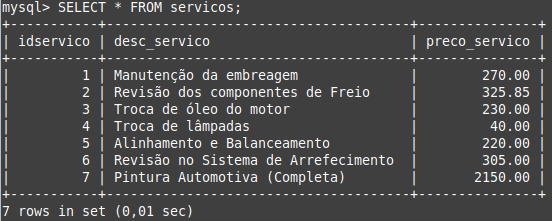
* ***pecas***

* ***ordens_servico***
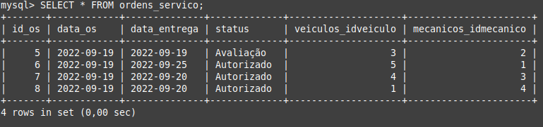
* ***det_os_servicos***
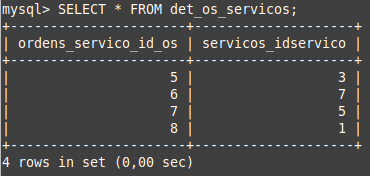
* ***det_os_pecas***
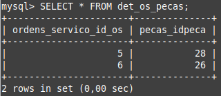

---

## 
QUERIES - Alguns exemplos ...

* *Recuperações simples com SELECT Statement*
* *Filtros com WHERE Statement*
* *Crie expressões para gerar atributos derivados*
* *Defina ordenações dos dados com ORDER BY*
* *Condições de filtros aos grupos – HAVING Statement*
* *Crie junções entre tabelas para fornecer uma*
* *perspectiva mais complexa dos dados*

#### Exemplo: ordenação 'desc'(descendente)': 
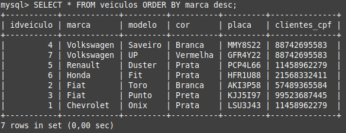

#### Exemplo: filtro 'WHERE': 
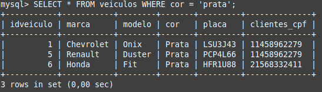

#### Exemplo: junção 'INNER JOIN' entre as tabelas 'clientes' e 'veiculos':
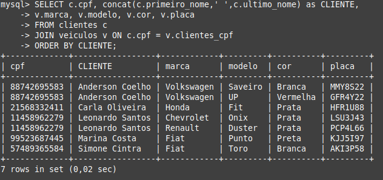

#### Exemplo: filtro 'WHERE' entre as tabelas 'clientes' e 'veiculos':
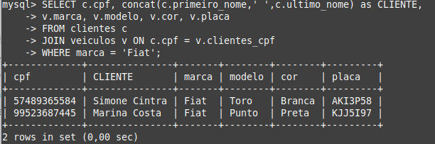

#### Exemplo: junções 'JOIN' envolvendo 4 tabelas:   
#### 'ordens_servico', 'det_os_servicos', 'servicos' e 'mecanicos'
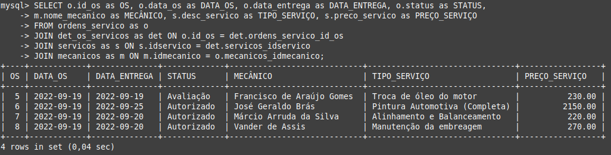

#### Exemplo: junções 'JOIN' envolvendo 5 tabelas:   
#### 'ordens_servico', 'det_os_servicos', 'servicos', 'det_os_pecas' e 'pecas'
#### para montar relatório com ***geração de atributo***: 'PREÇO_TOTAL' (SERVIÇO + PEÇA)
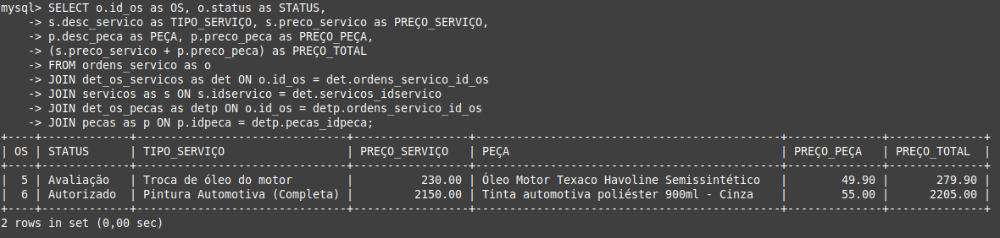

---